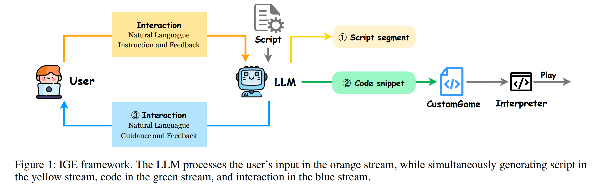

# Game Development as Human-LLM Interaction

Our paper: https://arxiv.org/pdf/2408.09386

## 🚀 Overview
We introduce the Interaction-driven Game Engine (IGE) powered by LLM, which allows everyone to develop a custom game using natural language through Human-LLM interaction.




## 🔧 Environment
```
conda env create -f requirements.txt
```
The specific environment configuration can be found in the `requirements.txt` file. 
Our experiments were conducted on a machine with 8×A800 GPUs.

## 📂 Data Generation

config openai_key: modify `utils.py` to config openai key
```bash
bash pipeline.sh
```

## 📘 Train
```bash
bash sft.sh
bash sft_complete.sh
```

## 📊 Eval
### eval our IGE
```bash
model=IGE_complete
CUDA_VISIBLE_DEVICES=0 python do_eval_interaction.py --model $model
python evaluate_interaction.py --model $model
python evaluate_wo_script.py --model $model
```

### eval all
config the `gpus` in `evaluate.sh` and then:
```bash
bash evaluate.sh
```

## 📖 Citation
```
@misc{hong2024gamedevelopmenthumanllminteraction,
      title={Game Development as Human-LLM Interaction}, 
      author={Jiale Hong and Hongqiu Wu and Hai Zhao},
      year={2024},
      eprint={2408.09386},
      archivePrefix={arXiv},
      primaryClass={cs.AI},
      url={https://arxiv.org/abs/2408.09386}, 
}
```